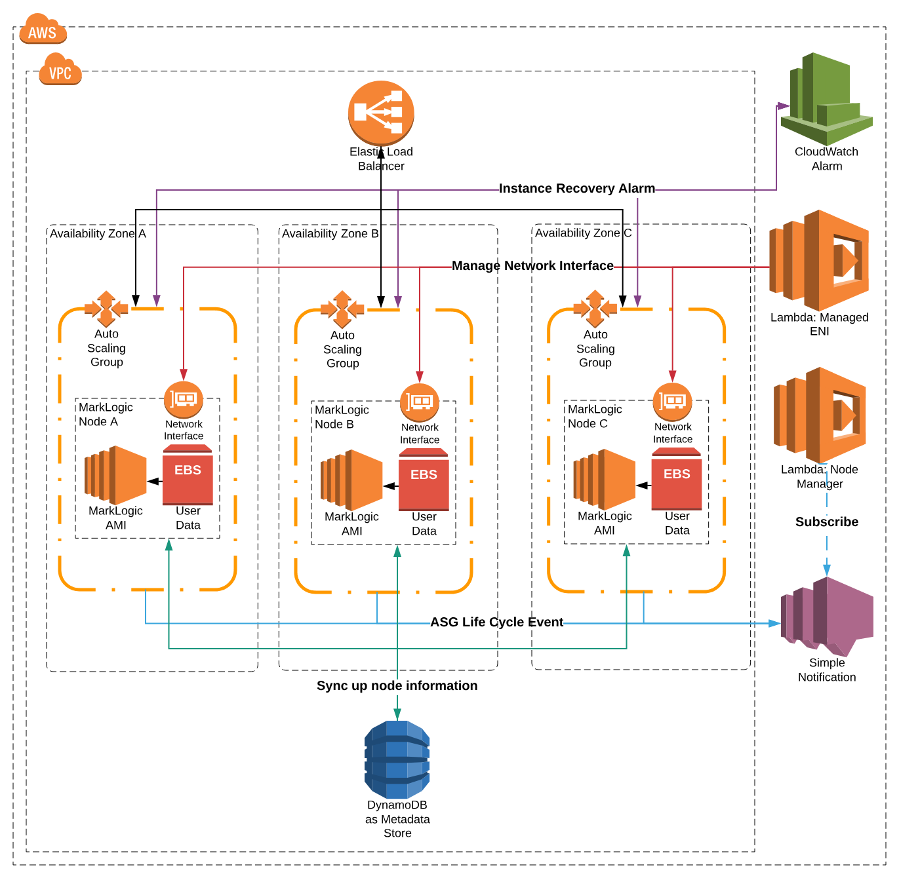

# MarkLogic CloudFormation Template on AWS

| Template Type | Launch in US West 2 (Oregon) |
| -- | -- |
| MarkLogic in New VPC |  |
| MarkLogic in Existing VPC |  |

This directory contains resources to launch a MarkLogic cluster on AWS by CloudFormation templates. This is a quick start deployment architecture. Users are encouraged to customize the templates to fit their needs for different purpose.

## Getting Started

- To deploy from MarkLogic Website, go to [MarkLogic and Amazon Web Service](https://developer.marklogic.com/products/cloud/aws).
- To deploy from this GitHub repository, click on `Launch Stack` button above.
- To customize the templates, clone this repository and make modification. You can deploy the modifed templates from AWS Web Console or AWS CLI. Refer to [AWS Documentation](https://docs.aws.amazon.com/AWSCloudFormation/latest/UserGuide/stacks.html) for instructions.

## Reference Architecture

The CloudFormation templates provide options to launch clusters with different settings. The table below summarizes a few possible settings.

| Option | Allowed Values |
| -- | -- |
| VPC | New or Existing |
| License | Developer, BYOL, Essential Enterprise |
| Availablity Zone | 1 or 3 |
| Nodes per Zone | 1 to many |

The parameterized templates will ask users to choose configurations prior to launch. With the chosen setting, the template will create resources by AWS service including but not limited to Elastic Compute Cloud, Elastic Block Storage, Virtual Private Cloud, DynamoDB, Simple Notification Service, CloudWatch, Lambda Functions, Elastic Load Balancer. The following image shows a typical architecture of the cluster on AWS.

This directory contains master templates, sub-templates and other resources that are used by templates such as Lambda function source code.

## Documentation

- [MarkLogic Server on AWS Guide](http://docs.marklogic.com/guide/ec2)
- [MarkLogic on Azure](https://developer.marklogic.com/products/cloud/aws)  
