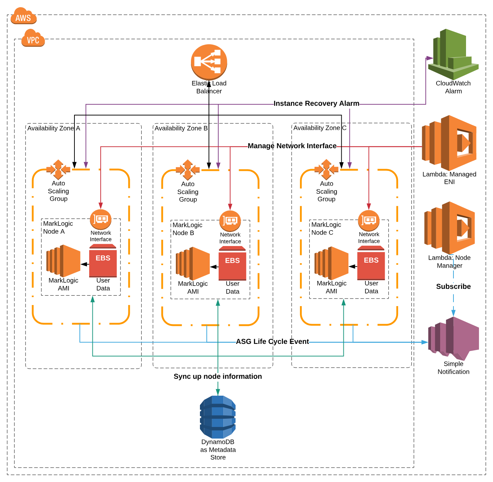

# MarkLogic CloudFormation Template on AWS

The CloudFormation templates provide options to launch MarkLogic clusters with different settings. The parameterized templates will ask users to choose configurations prior to launch. With the chosen setting, the template will create resources by AWS service including but not limited to Elastic Compute Cloud, Elastic Block Storage, Virtual Private Cloud, DynamoDB, Simple Notification Service, CloudWatch, Lambda Functions, Elastic Load Balancer.

This repository contains master templates, sub-templates and other resources that are used by CloudFormation such as Lambda function source code. This is a quick start deployment architecture. Users are encouraged to customize the templates to fit their needs for different purpose.

For deploying MarkLogic on Azure, please visit [cloud-enablement-azure](https://github.com/marklogic/cloud-enablement-azure).

:warning: **We have discovered and confirmed an unintended backward compatibility issue in MarkLogic Server version 11.3.5, which affects how MarkLogic REST API executes REST extensions with specific user privileges. As a result, any use of MarkLogic [REST API extensions](https://docs.progress.com/bundle/marklogic-server-develop-rest-api-12/page/topics/extensions.html#understanding-resource-service-extensions) may cause unexpected errors. We are working with highest priority to provide a product update with a fix as soon as possible. If your implementation relies on this functionality, we recommend delaying an upgrade until a new release is available. If you believe this issue may affect or has affected your implementation please contact Support for recommendations.**

## Getting Started

| Template Type | Launch in US West 2 (Oregon) |
| -- | -- |
| MarkLogic in New VPC |  |
| MarkLogic in Existing VPC |  |

- To deploy from MarkLogic Website, go to [MarkLogic and Amazon Web Service](https://developer.marklogic.com/products/cloud/aws).
- To deploy from this GitHub repository, click on `Launch Stack` button above.
- To customize the templates, clone this repository and make modification. You can deploy the modifed templates from AWS Web Console or AWS CLI. Refer to [AWS Documentation](https://docs.aws.amazon.com/AWSCloudFormation/latest/UserGuide/stacks.html) for instructions.

## Reference Architecture

The CloudFormation templates provide options to launch clusters with different settings. The table below summarizes a few possible settings.

| Option | Allowed Values |
| -- | -- |
| VPC | New or Existing |
| License | Developer, BYOL, Essential Enterprise |
| Availablity Zone | 1 or 3 |
| Nodes per Zone | 1 to many |

The parameterized templates will ask users to choose configurations prior to launch. With the chosen setting, the template will create resources by AWS service including but not limited to Elastic Compute Cloud, Elastic Block Storage, Virtual Private Cloud, DynamoDB, Simple Notification Service, CloudWatch, Lambda Functions, Elastic Load Balancer. The following image shows a typical architecture of the cluster on AWS.

This directory contains master templates, sub-templates and other resources that are used by templates such as Lambda function source code.

## Documentation

- [MarkLogic Server on AWS Guide](http://docs.marklogic.com/guide/ec2)
- [MarkLogic on AWS](https://developer.marklogic.com/products/cloud/aws)  

## Additional Notes
### AWS Graviton support in the MarkLogic CloudFormation Templates:

Starting with MarkLogic 11.3.4, the MarkLogic CloudFormation Template supports Amazon Linux 2023 for AWS Graviton. Select the "AmazonLinux2023-Graviton" value from "OSType" parameter and use "InstanceTypeGraviton" parameter to select the graviton instance types to create MarkLogic cluster using the AL2023 AWS Graviton AMI. The default value for the "OSType" parameter is "AmazonLinux2023".

### AmazonLinux2023 support in the MarkLogic CloudFormation Templates:

Starting with MarkLogic 11.3.1 (combined), the MarkLogic CloudFormation Template supports both Amazon Linux 2023 and Amazon Linux 2. Select the "AmazonLinux2023" value from "OSType" parameter to create MarkLogic cluster using the AL2023 AMI. The default value for the "OSType" parameter is "AmazonLinux2023".

MarkLogic on AL2023 does not support GPU devices. Any use of the embedded ONNX libraries will be executed using the host’s CPU. Support for GPUs on AL2023 is being investigated for a future release of MarkLogic Server.

### AWS Classic Load Balancer Removed from Single Zone Deployments:

Since AWS is retiring the Classic Load Balancer (CLB) as of August 15, 2022, the CLB has been removed for single-zone deployments in the MarkLogic CloudFormation templates. The URL in the outputs of the CloudFormation stack is now replaced with a private DNS name, which can be used to access the MarkLogic cluster.

### Python Upgrade for Lambda Functions in the MarkLogic CloudFormation Templates:

The lambda functions in MarkLogic CloudFormation templates used on AWS are now configured to use Python 3.13. AWS has scheduled the end of support for Python 3.9 by December 2025.

### Launch Templates and IMDSv2 support in the MarkLogic CloudFormation Templates:

Starting with MarkLogic 11.1.0, the MarkLogic CloudFormation Templates replaces the use of Launch Configurations with Launch Templates. This ensures that MarkLogic CFT users can make use of all of the Amazon EC2 Auto Scaling features now available in Launch Templates.

Additionally, MarkLogic 11.1.0 adds support for IMDSv2. The IMDSv2 option is set to "required" by default in the 11.1.0 and later CFTs. In order to use MarkLogic Server AMIs before 11.1.0 with the new templates, the templates need to be modified to set IMDSv2 to "optional" as IMDSv2 is not supported in earlier versions of the MarkLogic AMI.

## Support

The cloud-enablement-aws repository is maintained by MarkLogic Engineering and distributed under the [Apache 2.0 license](https://github.com/marklogic/cloud-enablement-aws/blob/master/LICENSE.TXT). Everyone is encouraged to file bug reports, feature requests, and pull requests through [GitHub](https://github.com/marklogic/cloud-enablement-aws/issues/new). Your input is important and will be carefully considered. However, we can’t promise a specific resolution or timeframe for any request. In addition, MarkLogic provides technical support for [releases](https://github.com/marklogic/cloud-enablement-aws/releases) of cloud-enablement-aws to licensed customers under the terms outlined in the [Support Handbook](http://www.marklogic.com/files/Mark_Logic_Support_Handbook.pdf). For more information or to sign up for support, visit [help.marklogic.com](http://help.marklogic.com).
